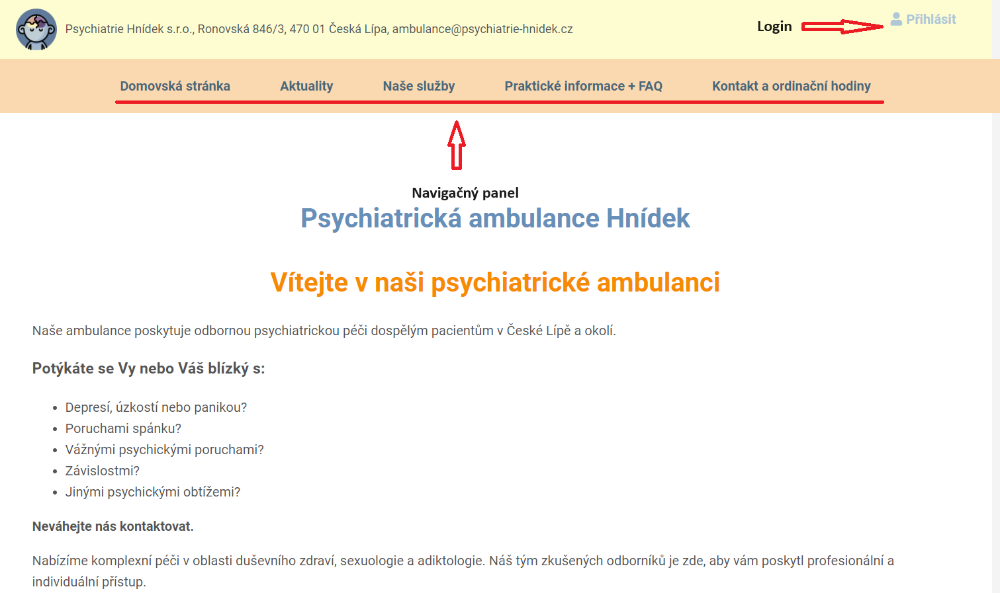
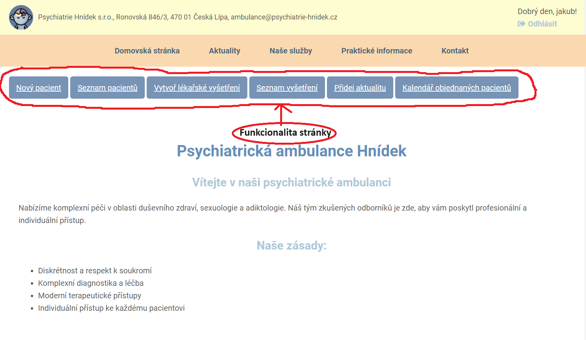
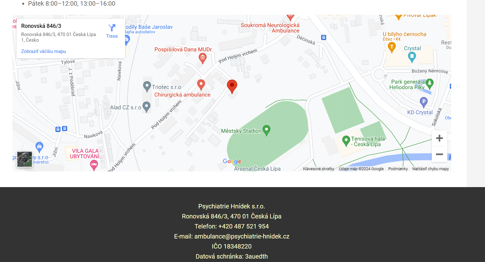
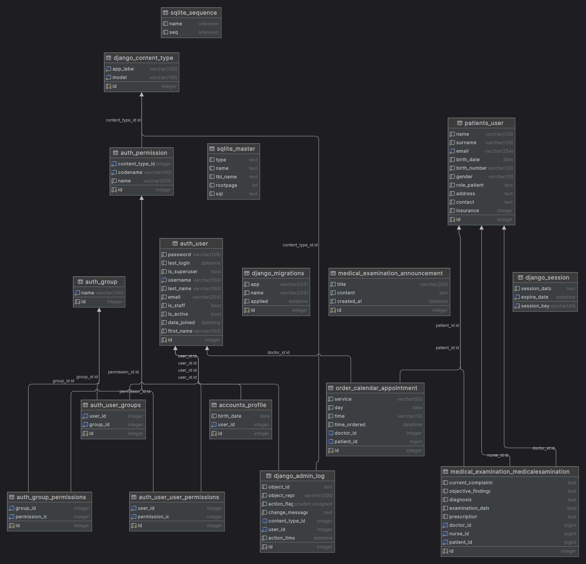

# Aplikace Ambulance 

## Tato aplikace byla vytvořena jako závěrečný projekt pro kurz Pythonu na SDAcademy.

### Tento projekt je databázový a objednávkový systém určený pro malou ambulanci. Tento projekt vychází ze skutečné soukromé ambulance. 

### Projekt je naprogramovaný v Djangu

# Kroky pro začátek
- Klonovat projekt : ``` https://github.com/Holubex/Ambulance.git ```
- Přejděte do souboru projektu
- Vytvoření virtuálního prostředí: ``` python -m venv myVenv ```
- Aktivace virtuálního prostředí: ``` source myVenv/bin/activate ```
- Instalace requirements : ``` pip install -r requirements.txt ``` anebo ```.\myVenv\Scripts\Activate.ps1
``` 
- Migrace : ``` python3 manage.py migrate ```
- Spusť : ``` python3 manage.py runserver ```

### 1. Po naklonování projektu spusťte projekt 

Stránka by měla být spuštěna na http://127.0.0.1:8000/



`python manage.py createsuperuser` vytvoří admina

### 2. Po přihlášení jako správce se zobrazí všechny funkce.



<u>Nový pacient</u> - formulář, který vytvoří záznam v databázi pacientů.

<u>Seznam pacientů</u> - seznamy pacientů (mohou zahrnovat lékaře i pacienty).

<u>Vytvoř lékařské vyšetření</u> - vytvoří lékařskou prohlídku. Tu by měl vytvořit pouze lékař.

<u>Seznam vyšetření</u> - úplný seznam vyšetření (přístup by měl mít pouze lékař).

<u>Přidej aktualitu</u> - tím se vytvoří aktualizace, která se zobrazí v hlavním navigačním poli Zprávy. To je určeno lidem, kteří jsou na stránce a mohou si oznámení zobrazit. (Může obsahovat oznámení o svátcích, omezeních atd.).

<u>Kalendář objednaných pacientů</u> - seznam vyšetření seřazený podle data.

### 3. Stránka Kontakt obsahuje interaktívnu mapu



### 4. Práva 

Na stránce http://127.0.0.1:8000/admin se přihlásíme do našeho účtu `admin`. Správce bude sloužit k přidělování práv lékařům a zdravotním sestrám. 
Celou registraci vytváří admin jako správce celého systému. Je to proto, že v dané ordinaci pracuje méně než 20 lidí a systém by spravoval jeden nebo maximálně dva lidé.

### 5. Aplikace 

Celý projekt se skládá z následujících aplikací: 

        - patients - databáza pacientov
        - order_calendar - je to aplikace, která vytváří schůzky pro pacienty. (v našem případě mají práva k této databázi pouze zdravotní sestry).
        - medical_examination - aplikace, která vytváří lékařská vyšetření. (v našem případě mají práva k této databázi pouze lékaři).
        - accounts - registrace
        - static_pages - statické stránky 

### ER diagram


